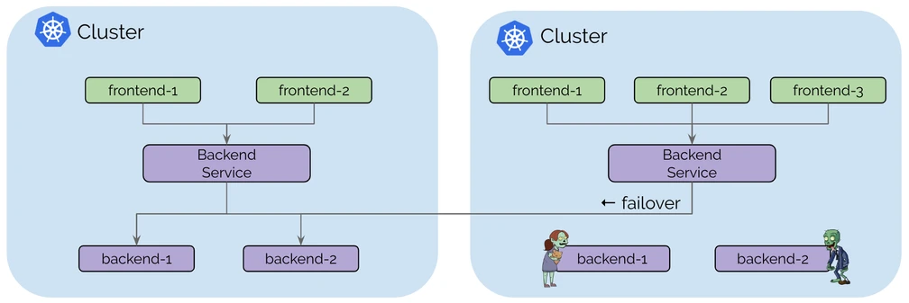
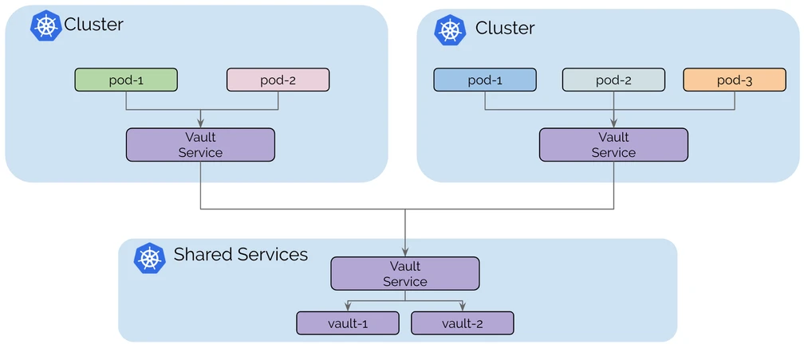

### Infra 
Multiple KIND clusters:
1. koornach
2. tion
3. global


koornacht-cluster-config.yml:  
```yml
apiVersion: kind.x-k8s.io/v1alpha4
kind: Cluster
networking:
  disableDefaultCNI: true
  podSubnet: 10.1.0.0/16
  serviceSubnet: 172.20.1.0/24
nodes:
- role: control-plane
  extraPortMappings:
  # localhost.run proxy
  - containerPort: 32042
    hostPort: 32042
  # Hubble relay
  - containerPort: 31234
    hostPort: 31234
  # Hubble UI
  - containerPort: 31235
    hostPort: 31235
- role: worker
- role: worker
```
kind_tion.yaml:
```yaml
---
apiVersion: kind.x-k8s.io/v1alpha4
kind: Cluster
networking:
  disableDefaultCNI: true
  podSubnet: 10.2.0.0/16
  serviceSubnet: 172.20.2.0/24
nodes:
- role: control-plane
- role: worker
- role: worker
```

Create the clusters:
```sh
# ⚠️ Create the Koornacht cluster
kind create cluster --name koornacht --config kind_koornacht.yaml
```

Verify that all 3 nodes are up:
```sh
# ⚠️ The nodes are marked as NotReady because there is not CNI plugin set up yet.
kubectl get nodes
```

Install Cilium on the clusters:
```sh
# ⚠️ For Koornacht 
cilium install \
  --set cluster.name=koornacht \
  --set cluster.id=1 \
  --set ipam.mode=kubernetes
```

Enable Hubble for observability, only on the Koornacht cluster:
```sh
# ⚠️ For Koornacht 
cilium hubble enable --ui
```

Verify that everything is fine with:
```sh
# ⚠️ For Koornacht 
cilium status --wait
```

-----Infra setup is done now-----

## Cluster Mesh Architecture
When activating Cluster Mesh on Cilium clusters, a new Control Plane is deployed to manage the mesh for this cluster, along with its etcd key-value store.  

Agents of other clusters can then access this Cluster Mesh Control Plane in read-only mode, allowing them to access metadata about the cluster, such as Service names and corresponding IPs.   
👍 Requirements for Cluster Mesh
Cilium Cluster Mesh allows to link multiple Kubernetes clusters, provided:
+ all clusters run Cilium as CNI
+ all worker nodes have a unique IP address and are able to connect to each other

## Enabling cluster mesh
This needs to be run against all clusters
```sh
# ⚠️ In *both* the Koornacht and Tion tabs
cilium clustermesh enable --service-type NodePort
```

>Note
>Several types of connectivity can be set up. We're using NodePort in our case as it's easier and we don't have dynamic load balancers available.
>
>For production clusters, it is strongly recommended to use LoadBalancer instead.

Check the status of the cluster mesh:
```sh
# ⚠️ In *both* the Koornacht and Tion tabs
cilium clustermesh status --wait
```

Status reported:
```sh
⚠️  Service type NodePort detected! Service may fail when nodes are removed from the cluster!
✅ Service "clustermesh-apiserver" of type "NodePort" found
✅ Cluster access information is available:
  - 172.18.0.7:32379
✅ Deployment clustermesh-apiserver is ready
🔌 No cluster connected
🔀 Global services: [ min:0 / avg:0.0 / max:0 ]
```

Running the command ```cilium status``` also gives the state of the cluster mesh.   

Connect the clusters by instructing one cluster to mesh with the second one. This needs to be done in a shell with access to both cluster contexts.

```sh
# ⚠️ In the Global tab
cilium clustermesh connect \
  --context kind-koornacht \
  --destination-context kind-tion
```
Results:
```sh
✅ Detected Helm release with Cilium version 1.14.1
✨ Extracting access information of cluster tion...
🔑 Extracting secrets from cluster tion...
⚠️  Service type NodePort detected! Service may fail when nodes are removed from the cluster!
ℹ️  Found ClusterMesh service IPs: [172.18.0.7]
✨ Extracting access information of cluster koornacht...
🔑 Extracting secrets from cluster koornacht...
⚠️  Service type NodePort detected! Service may fail when nodes are removed from the cluster!
ℹ️  Found ClusterMesh service IPs: [172.18.0.3]
⚠️ Cilium CA certificates do not match between clusters. Multicluster features will be limited!
ℹ️ Configuring Cilium in cluster 'kind-koornacht' to connect to cluster 'kind-tion'
ℹ️ Configuring Cilium in cluster 'kind-tion' to connect to cluster 'kind-koornacht'
✅ Connected cluster kind-koornacht and kind-tion!
```
This will ensure that the clusters are meshed.   

The status can also be checked by:
```sh
# ⚠️ In *both* the Koornacht and Tion tabs
cilium clustermesh status --wait
```

## 🌌 Deploying an application
We will now deploy a sample application on both Kubernetes clusters.   

This application will contain two deployments:  

+ a simple HTTP application called rebel-base, which will return a static JSON document
+ an x-wing pod which we will use to make requests to the rebel-base service from within the cluster  

The only difference between the two deployments will be the ConfigMap resource deployed, which will contain the static JSON document served by rebel-base, and whose content will depend on the cluster.   

deployment.yml
```yaml
---
apiVersion: apps/v1
kind: Deployment
metadata:
  name: rebel-base
spec:
  selector:
    matchLabels:
      name: rebel-base
  replicas: 2
  template:
    metadata:
      labels:
        name: rebel-base
    spec:
      containers:
      - name: rebel-base
        image: docker.io/nginx:1.15.8
        volumeMounts:
          - name: html
            mountPath: /usr/share/nginx/html/
        livenessProbe:
          httpGet:
            path: /
            port: 80
          periodSeconds: 1
        readinessProbe:
          httpGet:
            path: /
            port: 80
      volumes:
        - name: html
          configMap:
            name: rebel-base-response
            items:
              - key: message
                path: index.html
---
apiVersion: apps/v1
kind: Deployment
metadata:
  name: x-wing
spec:
  selector:
    matchLabels:
      name: x-wing
  replicas: 2
  template:
    metadata:
      labels:
        name: x-wing
    spec:
      containers:
      - name: x-wing-container
        image: docker.io/cilium/json-mock:1.2
        livenessProbe:
          exec:
            command:
            - curl
            - -sS
            - -o
            - /dev/null
            - localhost
        readinessProbe:
          exec:
            command:
            - curl
            - -sS
            - -o
            - /dev/null
            - localhost
```

ConfigMap:
```sh
apiVersion: v1
kind: ConfigMap
metadata:
  name: rebel-base-response
data:
  message: "{\"Cluster\": \"Koornacht\", \"Planet\": \"N'Zoth\"}\n"
```  

service.yaml 
```yaml
---
apiVersion: v1
kind: Service
metadata:
  name: rebel-base
spec:
  type: ClusterIP
  ports:
  - port: 80
  selector:
    name: rebel-base
```

Let's test this service, using the x-wing pod deployed alongside the rebel-base deployment:

```sh
# ⚠️ In the Koornacht tab
kubectl exec -ti deployments/x-wing -- /bin/sh -c 'for i in $(seq 1 10); do curl rebel-base; done'
```
You should see 10 lines of log, all containing:
```sh
{"Cluster": "Koornacht", "Planet": "N'Zoth"}
```

### 🌍 Making Services Global
When two or more clusters are meshed, Cilium allows you to set services as global in one or more clusters, by adding an annotation to them:
>service.cilium.io/global: "true"

When this annotation is set, requests to this service will load-balance to all available services with the same name and namespace in all meshed clusters.

💥 Fault Resilience   
One obvious usage of global services is fault tolerance.  

If a service becomes unavailable in one cluster, traffic can be redirected to the same service in other clusters, ensuring a continuity of service. 



🤲 Shared services
Another use case of global services is shared services.

This is particularly usefull when sharing stateful services between multiple Kubernetes clusters. If all clusters are meshed, the stateless applications spread among multiple clusters can all access the stateful services located on a single shared cluster.


### Making the service global
Let's make the service global on the mesh. Add the annotation to the service metadata:

#### ⚠️ In *both* the Koornacht and Tion tabs
```sh
kubectl annotate service rebel-base service.cilium.io/global="true"
```
When accessing the service from either cluster, it should now be load-balanced between the two clusters, because it is marked as global:

#### ⚠️ In the Koornacht tab
```sh
kubectl exec -ti deployments/x-wing -- /bin/sh -c 'for i in $(seq 1 10); do curl rebel-base; done'
```
You should see a mix of replies from the Koornacht and Tion clusters:
```sh
{"Cluster": "Koornacht", "Planet": "N'Zoth"}
{"Cluster": "Koornacht", "Planet": "N'Zoth"}
{"Cluster": "Koornacht", "Planet": "N'Zoth"}
{"Cluster": "Tion", "Planet": "Foran Tutha"}
{"Cluster": "Tion", "Planet": "Foran Tutha"}
{"Cluster": "Koornacht", "Planet": "N'Zoth"}
{"Cluster": "Tion", "Planet": "Foran Tutha"}
```

💥 Fault Resilience
With this setup in place, let's scale down the deployment on the >_ 1️⃣ Koornacht cluster:

# ⚠️ In the Koornacht tab
```sh
kubectl scale deployment rebel-base --replicas 0
```
Now check the replies when querying from the Koornacht cluster:

# ⚠️ In the Koornacht tab
```sh
kubectl exec -ti deployments/x-wing -- /bin/sh -c 'for i in $(seq 1 10); do curl rebel-base; done'
```

And from the >_ 2️⃣ Tion cluster:

# ⚠️ In the Tion tab
```sh
kubectl exec -ti deployments/x-wing -- /bin/sh -c 'for i in $(seq 1 10); do curl rebel-base; done'
```
You should see only entries like:
```sh
{"Cluster": "Tion", "Planet": "Foran Tutha"}
```

You can see that requesting the service on both clusters now only yields answers from the Tion cluster, effectively making up for the missing pods on the Koornacht cluster.

### 🌎 Global vs Shared
We've seen how the service.cilium.io/global annotation allows for a cluster to load-balance requests to a service to all meshed clusters with the same annotated service.

What if you want to remove the service of a specific cluster from the global service?

The service.cilium.io/shared annotation can be used for this.

#### 🚫 Disabling Global Service
By default, a service marked as global is considered shared as well, so the value of service.cilium.io/shared is true for all clusters where the service is marked as global.

Setting it to false in a cluster removes that specific service from the global service:
> service.cilium.io/shared: "false"

Now we want to prevent the Tion cluster from accessing the service running on the Koornacht cluster. Let's add the service.cilium.io/shared=false annotation to the service on >_ 1️⃣ Koornacht to opt out of the global service:
```sh
# ⚠️ In the Koornacht tab
kubectl annotate service rebel-base service.cilium.io/shared="false"
```


### ⏳ Global services & latency
Global services allow to load-balance traffic across multiple clusters.  

As we have seen, this is very useful to implement a fallback policy for redundant services.   

Most of the time however, it would be useful to limit latency by only using remote services when local ones are not available.  

This is the objective of service affinity.  
#### 🏠 Adding a local affinity
 
Let's consider the Koornacht service, which currently load balances to both clusters.

We would like to make it so that it always sends traffic to the Koornacht pods if available, but sends to the Tion pods if no pods are found on the Koornacht cluster.

In order to achieve this, let's add a new annotation to the >_ 1️⃣ Koornacht service:
```sh
# ⚠️ In the Koornacht tab
kubectl annotate service rebel-base service.cilium.io/affinity=local
```
Test the requests to the Koornacht service, which now only target the Koornacht pods:

```sh
# ⚠️ In the Koornacht tab
kubectl exec -ti deployments/x-wing -- /bin/sh -c 'for i in $(seq 1 10); do curl rebel-base; done'
```

Now scale down the Koornacht deployment:
```sh
# ⚠️ In the Koornacht tab
kubectl scale deployment rebel-base --replicas 0
```
And try again:

```sh
# ⚠️ In the Koornacht tab
kubectl exec -ti deployments/x-wing -- /bin/sh -c 'for i in $(seq 1 10); do curl rebel-base; done'
```
All traffic now goes to the Tion cluster.   
> Note
>The opposite effect can be obtained by using remote as the annotation value.

### 👮 Securing Cross-Cluster Communication
In the previous examples, we have used a pod (x-wing) as a curl client to access another set of pods (rebel-base) either in a local or a remote cluster.   

Cilium Network Policies are Kubernetes resources which allow to restrict access between pods, by labels.   

🛡️ Cross-Cluster Network Policies
When using Cilium Cluster Mesh, it is possible to add Cilium Network Policies to filter traffic between clusters.   

At the moment, the Koornacht service load-balances to both Koornacht and Tion clusters, with a local affinity.   

In the context of a Zero-Trust security policy, we would like to block all traffic, and then allow only what is necessary. 

#### 🗑 Remove affinity

For this challenge, let's start by removing the local affinity we placed on the >_ 1️⃣ Koornacht service earlier:
```sh
# ⚠️ In the Koornacht tab
kubectl annotate service rebel-base service.cilium.io/affinity-
```
Check that the service balances again to both clusters:
```sh
# ⚠️ In the Koornacht tab
# ⚠️ In the Koornacht tab
kubectl exec -ti deployments/x-wing -- /bin/sh -c 'for i in $(seq 1 10); do curl --max-time 2 rebel-base; done'
```
#### ❌ Default Deny
By default, all communication is allowed between the pods. In order to implement Network Policies, we thus need to start with a default deny rule, which will disallow communication. We will then add specific rules to add the traffic we want to allow.  

Adding a default deny rule is achieved by selecting all pods (using {} as the value for the endpointSelector field) and using empty rules for ingress and egress fields.   

However, blocking all egress traffic would prevent nodes from performing DNS requests to Kube DNS, which is something we want to avoid. For this reason, our default deny policy will include an egress rule to allow access to Kube DNS on UDP/53, so all pods are able to resolve service names:   
```yaml
---
apiVersion: "cilium.io/v2"
kind: CiliumNetworkPolicy
metadata:
  name: "default-deny"
spec:
  description: "Default Deny"
  endpointSelector: {}
  ingress:
    - {}
  egress:
    - toEndpoints:
        - matchLabels:
            io.kubernetes.pod.namespace: kube-system
            k8s-app: kube-dns
      toPorts:
        - ports:
            - port: "53"
              protocol: UDP
          rules:
            dns:
              - matchPattern: "*"
```

As expected from the application of the default deny policy, all requests now time out.   

#### ✅ Allowing Cross-Cluster traffic
We want to allow the Koornacht x-wing pods to access the rebel-base pods on both the local and Tion clusters. Since all traffic is now denied by default, we need to add a new Network Policy to allow this specific traffic.


This CiliumNetworkPolicy resource allows the pods with a name=x-wing label located in the koornacht cluster to reach out to any pod with a name=rebel-base label.
```yaml
---
apiVersion: "cilium.io/v2"
kind: CiliumNetworkPolicy
metadata:
  name: "x-wing-to-rebel-base"
spec:
  description: "Allow x-wing in Koornacht to contact rebel-base"
  endpointSelector:
    matchLabels:
      name: x-wing
      io.cilium.k8s.policy.cluster: koornacht
  egress:
  - toEndpoints:
    - matchLabels:
        name: rebel-base
```

Apply the policy
```sh
# ⚠️ In the Koornacht tab
kubectl apply -f x-wing-to-rebel-base.yaml
```
The requests are still dropped. Our default deny policy blocks both ingress and egress connections for all pods, but the new policy we've added only allows egress connectivity. We also need to allow ingress connections to reach the rebel-base pods. Let's fix this with a new CiliumNetworkPolicy resource:
```yaml
---
apiVersion: "cilium.io/v2"
kind: CiliumNetworkPolicy
metadata:
  name: "rebel-base-from-x-wing"
spec:
  description: "Allow rebel-base to be contacted by Koornacht's x-wing"
  endpointSelector:
    matchLabels:
      name: rebel-base
  ingress:
  - fromEndpoints:
    - matchLabels:
        name: x-wing
        io.cilium.k8s.policy.cluster: koornacht
```

```sh
# ⚠️ In the Koornacht tab
kubectl apply -f rebel-base-from-x-wing.yaml
Now test the service again:
```
```sh
# ⚠️ In the Koornacht tab
kubectl exec -ti deployments/x-wing -- /bin/sh -c 'for i in $(seq 1 10); do curl --max-time 2 rebel-base; done'
```
It works, but only partially, as only the requests to the Koornacht cluster go through.

This is because we haven't applied any specific policies to the Tion cluster, where the default deny policy was also deployed.    

We need to apply the rebel-base-from-x-wing Network Policy to the Tion cluster to allow the ingress connection:
```sh
# ⚠️ In the Tion tab
kubectl apply -f rebel-base-from-x-wing.yaml
```

The requests all go through, and we have successfully secured our service across clusters!    

+ Cilium allows to filter network requests across clusters
+ The io.cilium.k8s.policy.cluster can be used in an endpointSelector
+ The io.cilium.k8s.policy.cluster can be used in an ingress rule
+ The io.cilium.k8s.policy.cluster can be used in an egress rule
