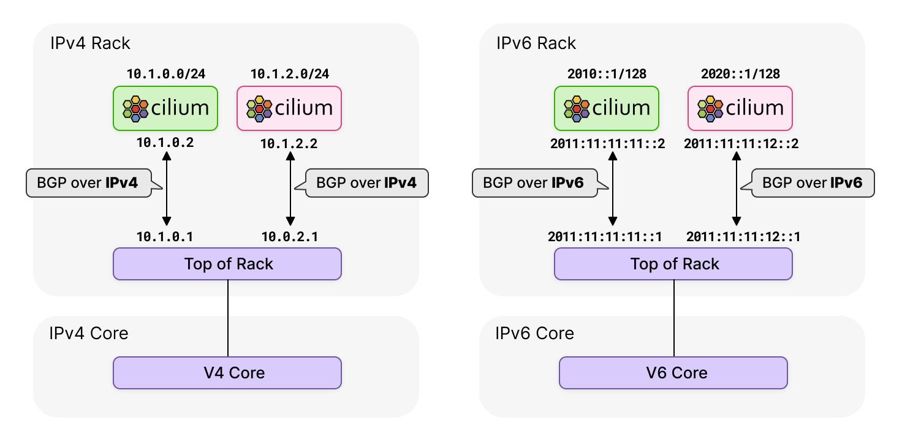

## 🧪 Containerlab
Containerlab is a platform that enables users to deploy virtual networking topologies, based on containers and virtual machines. One of the virtual routing appliances that can be deployed via Containerlab is FRR - a feature-rich open-source networking platform.



### Installation
```sh
echo "deb [trusted=yes] https://apt.fury.io/netdevops/ /" | \
sudo tee -a /etc/apt/sources.list.d/netdevops.list

sudo apt update && sudo apt install containerlab

```DOES NOT WORK
# Getting the LATEST using the above command did not work.
# instead I got this latest version manually https://github.com/srl-labs/containerlab/releases/tag/v0.49.0
#export LATEST="https://github.com/srl-labs/containerlab/releases/tag/v0.49.0"
# Again I downloaded the latest version using - wget https://github.com/srl-labs/containerlab/releases/download/v0.49.0/containerlab_0.49.0_Linux_amd64.tar.gz
# Not the above step but this is a preferred way because then the remaning steps are easier: curl -L -o /tmp/clab.tar.gz https://github.com/srl-labs/container
lab/releases/download/v0.49.0/containerlab_0.49.0_Linux_amd64.tar.gz

```sh
# get the latest available tag
LATEST=$(curl -s https://github.com/srl-labs/containerlab/releases/latest | \
       sed -e 's/.*tag\/v\(.*\)\".*/\1/')


# download tar.gz archive
curl -L -o /tmp/clab.tar.gz "https://github.com/srl-labs/containerlab/releases/download/v${LATEST}/containerlab_${LATEST}_Linux_amd64.tar.gz"
```

Followed the remaining steps 
```sh
# create containerlab directory
sudo mkdir -p /etc/containerlab

# extract downloaded archive into the containerlab directory
sudo tar -zxvf /tmp/clab.tar.gz -C /etc/containerlab

# (optional) move containerlab binary somewhere in the $PATH
sudo mv /etc/containerlab/containerlab /usr/bin && sudo chmod a+x /usr/bin/containerlab

```


topo.yaml 
```yaml
name: bgp-cplane-devel
topology:
  kinds:
    linux:
      cmd: bash
  nodes:
    tor:
      kind: linux
      image: frrouting/frr:v8.2.2
      exec:
        # peer over this link with cilium
        - ip addr add 172.0.0.1/24 dev net0
        # Boiler plate to make FRR work
        - touch /etc/frr/vtysh.conf
        - touch /var/log/frr.log
        - chown frr:frr /var/log/frr.log
        - sed -i -e 's/bgpd=no/bgpd=yes/g' /etc/frr/daemons
        - /usr/lib/frr/frrinit.sh start
        - >-
          vtysh -c 'conf t'
          -c 'log file /var/log/frr.log'
          -c 'debug bgp neighbor-events'
          -c 'debug bgp updates'
          -c 'debug bgp zebra'
          -c '! peer with Cilium'
          -c 'router bgp 65000'
          -c ' no bgp ebgp-requires-policy'    
          -c ' bgp router-id 172.0.0.1'
          -c ' neighbor 172.0.0.2 remote-as 65001'
          -c ' address-family ipv6 unicast'
          -c '  neighbor 172.0.0.2  activate'
          -c ' exit-address-family'
          -c '!'
    cilium:
      kind: linux
      image: nicolaka/netshoot:latest
      network-mode: container:clab-bgp-cplane-devel-control-plane
      exec:
        # peer over this link with tor
      - ip addr add 172.0.0.2/24 dev net0
  links:
    - endpoints: ["tor:net0", "cilium:net0"]

 ```   
 The main thing to notice is that we are deploying 1 routing node: a single Top of Rack (ToR) router (tor). We are pre-configuring it at boot time with its IP and BGP configuration. At the end of the YAML file, you will also note we are establishing a virtual link between the Cilium node and the ToR router.

 ### 🚀 Deploy the networking topology
```sh
containerlab -t topo.yaml deploy
```


## References
1. https://blog.sflow.com/2021/04/containerlab.html
2. https://nicovibert.com/2022/06/09/first-look-into-containerlab/
