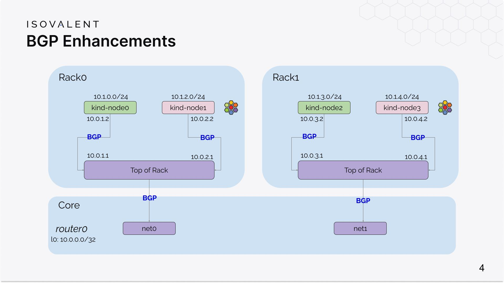

BGP on Cilium
What is BGP?
Why is it important for a networking solution?
What is an alternative to BGP?
Can I continue investigating BGP locally?


Setting up cilium on KIND.
This cluster config will set up a 4 node kubernetes clusters:
+ 1 control-plane
+ 3 worker nodes
Cluster.yml
```yaml
kind: Cluster
name: clab-bgp-cplane-demo
apiVersion: kind.x-k8s.io/v1alpha4
networking:
  disableDefaultCNI: true
  podSubnet: "10.1.0.0/16"
nodes:
- role: control-plane
  kubeadmConfigPatches:
  - |
    kind: InitConfiguration
    nodeRegistration:
      kubeletExtraArgs:
        node-ip: "10.0.1.2"
        node-labels: "rack=rack0"
- role: worker
  kubeadmConfigPatches:
  - |
    kind: JoinConfiguration
    nodeRegistration:
      kubeletExtraArgs:
        node-ip: "10.0.2.2"
        node-labels: "rack=rack0"
- role: worker
  kubeadmConfigPatches:
  - |
    kind: JoinConfiguration
    nodeRegistration:
      kubeletExtraArgs:
        node-ip: "10.0.3.2"
        node-labels: "rack=rack1"
- role: worker
  kubeadmConfigPatches:
  - |
    kind: JoinConfiguration
    nodeRegistration:
      kubeletExtraArgs:
        node-ip: "10.0.4.2"
        node-labels: "rack=rack1"
containerdConfigPatches:
- |-
  [plugins."io.containerd.grpc.v1.cri".registry.mirrors."localhost:5000"]
    endpoint = ["http://kind-registry:5000"]
```	


### Networking
The networking section in the configuration above disables the default CNI. Cilium will be deployed to provide this functionality.
On installing the cluster without the CNI, the state of the cluster nodes will be reported as 'not ready'.  
VIew the state:
```sh
kubectl get no -o wide
```


### Networking Fabric
This will need a BGP capable device.    
```Containerlab``` and ```Free Range Routing(FRR)``` are tools that provide the ability to simulate networking environment in containers.   
topo.yml   
```yaml
name: bgp-cplane-demo
topology:
  kinds:
    linux:
      cmd: bash
  nodes:
    router0:
      kind: linux
      image: frrouting/frr:v8.2.2
      labels:
        app: frr
      exec:
        # NAT everything in here to go outside of the lab
        - iptables -t nat -A POSTROUTING -o eth0 -j MASQUERADE
        # Loopback IP (IP address of the router itself)
        - ip addr add 10.0.0.0/32 dev lo
        # Terminate rest of the 10.0.0.0/8 in here
        - ip route add blackhole 10.0.0.0/8
        # Boiler plate to make FRR work
        - touch /etc/frr/vtysh.conf
        - sed -i -e 's/bgpd=no/bgpd=yes/g' /etc/frr/daemons
        - /usr/lib/frr/frrinit.sh start
        # FRR configuration
        - >-
          vtysh -c 'conf t' -c 'frr defaults datacenter' -c 'router bgp 65000' -c '  bgp router-id 10.0.0.0' -c '  no bgp ebgp-requires-policy' -c '  neighbor ROUTERS peer-group' -c '  neighbor ROUTERS remote-as external' -c '  neighbor ROUTERS default-originate' -c '  neighbor net0 interface peer-group ROUTERS' -c '  neighbor net1 interface peer-group ROUTERS' -c '  address-family ipv4 unicast' -c '    redistribute connected' -c '  exit-address-family' -c '!'
    tor0:
      kind: linux
      image: frrouting/frr:v8.2.2
      labels:
        app: frr
      exec:
        - ip link del eth0
        - ip addr add 10.0.0.1/32 dev lo
        - ip addr add 10.0.1.1/24 dev net1
        - ip addr add 10.0.2.1/24 dev net2
        - touch /etc/frr/vtysh.conf
        - sed -i -e 's/bgpd=no/bgpd=yes/g' /etc/frr/daemons
        - /usr/lib/frr/frrinit.sh start
        - >-
          vtysh -c 'conf t' -c 'frr defaults datacenter' -c 'router bgp 65010' -c '  bgp router-id 10.0.0.1' -c '  no bgp ebgp-requires-policy' -c '  neighbor ROUTERS peer-group' -c '  neighbor ROUTERS remote-as external' -c '  neighbor SERVERS peer-group' -c '  neighbor SERVERS remote-as internal' -c '  neighbor net0 interface peer-group ROUTERS' -c '  neighbor 10.0.1.2 peer-group SERVERS' -c '  neighbor 10.0.2.2 peer-group SERVERS' -c '  address-family ipv4 unicast' -c '    redistribute connected' -c '  exit-address-family' -c '!'
    tor1:
      kind: linux
      image: frrouting/frr:v8.2.2
      labels:
        app: frr
      exec:
        - ip link del eth0
        - ip addr add 10.0.0.2/32 dev lo
        - ip addr add 10.0.3.1/24 dev net1
        - ip addr add 10.0.4.1/24 dev net2
        - touch /etc/frr/vtysh.conf
        - sed -i -e 's/bgpd=no/bgpd=yes/g' /etc/frr/daemons
        - /usr/lib/frr/frrinit.sh start
        - >-
          vtysh -c 'conf t' -c 'frr defaults datacenter' -c 'router bgp 65011' -c '  bgp router-id 10.0.0.2' -c '  bgp bestpath as-path multipath-relax' -c '  no bgp ebgp-requires-policy' -c '  neighbor ROUTERS peer-group' -c '  neighbor ROUTERS remote-as external' -c '  neighbor SERVERS peer-group' -c '  neighbor SERVERS remote-as internal' -c '  neighbor net0 interface peer-group ROUTERS' -c '  neighbor 10.0.3.2 peer-group SERVERS' -c '  neighbor 10.0.4.2 peer-group SERVERS' -c '  address-family ipv4 unicast' -c '    redistribute connected' -c '  exit-address-family' -c '!'
    srv-control-plane:
      kind: linux
      image: nicolaka/netshoot:latest
      network-mode: container:control-plane
      exec:
        # Cilium currently doesn't support BGP Unnumbered
        - ip addr add 10.0.1.2/24 dev net0
        # Cilium currently doesn't support importing routes
        - ip route replace default via 10.0.1.1
    srv-worker:
      kind: linux
      image: nicolaka/netshoot:latest
      network-mode: container:worker
      exec:
        - ip addr add 10.0.2.2/24 dev net0
        - ip route replace default via 10.0.2.1
    srv-worker2:
      kind: linux
      image: nicolaka/netshoot:latest
      network-mode: container:worker2
      exec:
        - ip addr add 10.0.3.2/24 dev net0
        - ip route replace default via 10.0.3.1
    srv-worker3:
      kind: linux
      image: nicolaka/netshoot:latest
      network-mode: container:worker3
      exec:
        - ip addr add 10.0.4.2/24 dev net0
        - ip route replace default via 10.0.4.1
  links:
    - endpoints: ["router0:net0", "tor0:net0"]
    - endpoints: ["router0:net1", "tor1:net0"]
    - endpoints: ["tor0:net1", "srv-control-plane:net0"]
    - endpoints: ["tor0:net2", "srv-worker:net0"]
    - endpoints: ["tor1:net1", "srv-worker2:net0"]
    - endpoints: ["tor1:net2", "srv-worker3:net0"]
```	
Create the network with the containerlab functionality.
```sh
containerlab -t topo.yaml deploy
```

This should result in the topology:


Verify this configuration using 
```sh
docker exec -it clab-bgp-cplane-demo-router0 vtysh -c 'show bgp ipv4 summary wide'
```

### Install Cilium
Ensure Cilium CLI is installed. 
```sh
CILIUM_CLI_VERSION=$(curl -s https://raw.githubusercontent.com/cilium/cilium-cli/main/stable-v0.14.txt)
CLI_ARCH=amd64
if [ "$(uname -m)" = "aarch64" ]; then CLI_ARCH=arm64; fi
curl -L --fail --remote-name-all https://github.com/cilium/cilium-cli/releases/download/${CILIUM_CLI_VERSION}/cilium-linux-${CLI_ARCH}.tar.gz{,.sha256sum}
sha256sum --check cilium-linux-${CLI_ARCH}.tar.gz.sha256sum
sudo tar xzvfC cilium-linux-${CLI_ARCH}.tar.gz /usr/local/bin
rm cilium-linux-${CLI_ARCH}.tar.gz{,.sha256sum}
```


```sh
cilium install \
    --set ipam.mode=kubernetes \
    --set tunnel=disabled \
    --set ipv4NativeRoutingCIDR="10.0.0.0/8" \
    --set bgpControlPlane.enabled=true \
    --set k8s.requireIPv4PodCIDR=true
```
    
Create the cilium-bgp-peering-policies.yaml
```
---
apiVersion: "cilium.io/v2alpha1"
kind: CiliumBGPPeeringPolicy
metadata:
  name: rack0
spec:
  nodeSelector:
    matchLabels:
      rack: rack0
  virtualRouters:
    - localASN: 65010
      exportPodCIDR: true
      neighbors:
        - peerAddress: "10.0.0.1/32"
          peerASN: 65010
---
apiVersion: "cilium.io/v2alpha1"
kind: CiliumBGPPeeringPolicy
metadata:
  name: rack1
spec:
  nodeSelector:
    matchLabels:
      rack: rack1
  virtualRouters:
    - localASN: 65011
      exportPodCIDR: true
      neighbors:
        - peerAddress: "10.0.0.2/32"
          peerASN: 65011
```		  

The key aspects of the policy are:

+ the remote peer IP address (peerAddress) and AS Number (peerASN)
+ your own local AS Number (localASN) And that's it!
In this lab, we specify the loopback IP addresses of our BGP peers: the Top of Rack devices tor0 (10.0.0.1/32) and tor1 (10.0.0.2/32).

Note that BGP configuration on Cilium is label-based - the Cilium-managed nodes with a matching label will deploy a virtual router for BGP peering purposes.

      
Verify the label configuration with the following commands:
```sh
kubectl get nodes -l 'rack in (rack0,rack1)'
```

   
```sh
kubectl apply -f cilium-bgp-peering-policies.yaml
```   

To verify successful BGP peering:  
TOR0   
```
docker exec -it clab-bgp-cplane-demo-tor0 vtysh -c 'show bgp ipv4 summary wide'
```
   
TOR1  
```sh
docker exec -it clab-bgp-cplane-demo-tor1 vtysh -c 'show bgp ipv4 summary wide'
```

Create the networking utilities pod:
```yaml
apiVersion: apps/v1
kind: DaemonSet
metadata:
  name: netshoot
spec:
  selector:
    matchLabels:
      app: netshoot
  template:
    metadata:
      labels:
        app: netshoot
    spec:
      tolerations:
      - key: node-role.kubernetes.io/master
        operator: Exists
        effect: NoSchedule
      containers:
      - name: netshoot
        image: nicolaka/netshoot:latest
        command: ["sleep", "infinite"]
```		
Verify that the netshoot pods have been sucessfully deployed:
```
kubectl rollout status ds/netshoot -w
```

#### Verify end-to-end connectivity
We will now be running a series of connectivity tests, from a source Pod on a node in rack0 to a destination Pod in rack1. These packets will traverse the our virtual networking backbone and validate that the whole data path is working as expected.

Run the following commands.

First, let's find the name of a source Pod in rack0.
```sh
SRC_POD=$(kubectl get pods -o wide | grep "cplane-demo-worker " | awk '{ print($1); }')
```

Next, let's get the IP address of a destination Pod in rack1.
```sh
DST_IP=$(kubectl get pods -o wide | grep worker3 | awk '{ print($6); }')
```

Finally, let's execute a ping from the source Pod to the destination IP.
```sh
kubectl exec -it $SRC_POD -- ping $DST_IP
```

You should see packets flowing across your virtual data center. Well done: your Kubernetes Pods located in different rack servers in your (virtual) datacenter can communicate together across the network backbone! 

